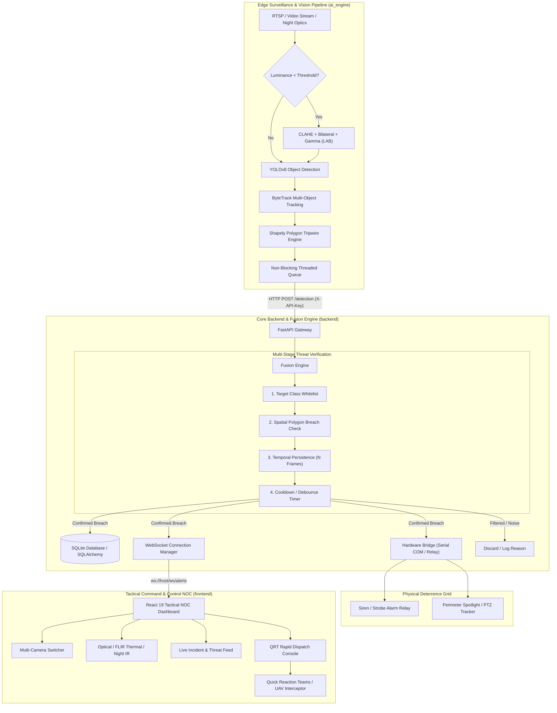

# SIMA-DRISHTI (सीमा दृष्टि)
### *Next-Generation Autonomous Perimeter Defense & AI Tactical Border Surveillance*

[](https://www.python.org/)
[](https://fastapi.tiangolo.com/)
[](https://github.com/ultralytics/ultralytics)
[](https://react.dev/)
[](https://vitejs.dev/)
[](https://tailwindcss.com/)
[](LICENSE)

---

## Executive Summary

**SIMA-DRISHTI** (*"Border Vision"* — from the Sanskrit *Sīmā* [Border] and *Dṛṣṭi* [Vision / Sight]) is an integrated, edge-optimized tactical surveillance and perimeter intrusion detection platform. Designed to convert legacy CCTV and thermal optic infrastructure into an intelligent, low-latency tactical defense grid, SIMA-DRISHTI autonomously detects, tracks, and verifies boundary breaches in real time while minimizing false alarms and streamlining Quick Reaction Team (QRT) dispatches.

Traditional border surveillance faces acute operational friction: human operator fatigue across 24/7 video walls, frequent false alarms from wildlife or environmental factors, poor night visibility, and delayed response coordination. **SIMA-DRISHTI** solves these challenges through an end-to-end edge-to-command pipeline combining computer vision, multi-stage sensor fusion, hardware actuation, and a defense-grade tactical Web command center.

---

## Key Capabilities

- **Autonomous Edge AI & Tracking**: Powered by YOLOv8 and ByteTrack multi-object tracking (MOT) for persistent target association across video frames.
- **Adaptive Low-Light / Night Enhancement**: Automatic luminance detection with dynamic CLAHE (Contrast Limited Adaptive Histogram Equalization), bilateral filtering, and inverse gamma correction in LAB color space for adverse visual conditions.
- **Geofenced Virtual Tripwires**: Polygon-based perimeter vector zones powered by Shapely geometry, tracking the precise foot-contact/anchor point of targets to eliminate perspective distortion.
- **Multi-Stage Sensor Fusion Engine**:
  - **Class Whitelisting**: Isolates high-threat classes (`person`, `car`, `truck`, `bus`) and discards benign entities (wildlife, foliage, livestock).
  - **Temporal Persistence Validation**: Requires sustained intrusion across configurable consecutive frames to filter sensor glints and transient optical anomalies.
  - **Intelligent Alert Debounce / Cooldown**: Prevents alert flooding and alert fatigue using an automated cooldown timer per tracked target.
- **Physical Hardware Actuation**: Microcontroller serial bridge (`pyserial`) driving physical perimeter sirens, floodlights, and deterrence relays with an automated simulation fallback mode.
- **Real-Time Telemetry & WebSockets**: Low-latency event broadcast via WebSocket (`/ws/alerts`) pushing incident alerts, bounding telemetry, GPS coordinates, and snapshot previews to connected control rooms.
- **Defense-Grade Command Dashboard**:
  - **Tactical HUD**: Switchable Optical, FLIR Thermal, and Night IR filters with digital PTZ zoom.
  - **Multi-Camera Matrix**: Real-time status monitoring across multiple sectors.
  - **Integrated QRT Dispatch Manager**: One-click operational dispatch for Ground Patrol Units, Heavy Armored QRTs, and UAV Interceptor Drones.

---

## System Architecture



---

## Repository Structure

```plaintext
sima-drishti/
├── ai_engine/                    # Edge AI & Vision Pipeline
│   ├── ai_pipeline.py            # YOLOv8 + ByteTrack + Tripwire + CLAHE runner
│   ├── requirements.txt          # Computer vision dependencies (ultralytics, opencv, shapely)
│   ├── yolov8n.pt                # YOLOv8 nano edge model weights
│   └── media/                    # Sample test surveillance videos
│
├── backend/                      # FastAPI Intelligence & Telemetry Core
│   ├── requirements.txt          # Backend dependencies (fastapi, uvicorn, sqlalchemy, pyserial)
│   ├── test_feed.py              # Test suite simulating edge detections & persistence checks
│   ├── test_ws_client.py         # Async WebSocket listener testing real-time alert delivery
│   ├── static/                   # Static assets & generated breach thumbnails
│   └── app/
│       ├── __init__.py           # Package marker
│       ├── main.py               # FastAPI application, CORS, routers & WebSocket manager
│       ├── fusion.py             # Multi-stage sensor fusion, debounce & persistence engine
│       ├── hardware.py           # PySerial hardware bridge with simulation fallback
│       ├── database.py           # SQLAlchemy session setup & engine configuration
│       ├── models.py             # Database schemas: AlertLog and Zone models
│       ├── schemas.py            # Pydantic validation schemas for ingest & outputs
│       ├── auth.py               # API Key security verification middleware
│       └── utils.py              # Housekeeping routines (24h thumbnail TTL cleanup)
│
├── frontend/                     # React 19 + Vite Tactical Command Center
│   ├── index.html                # Application root with custom styling & fonts
│   ├── package.json              # Frontend manifest (React, Lucide icons, Vite)
│   ├── vite.config.js            # Vite build configuration
│   └── src/
│       ├── main.jsx              # React entry point
│       ├── App.jsx               # Main container with tactical screen switcher
│       ├── App.css               # Component layout styles
│       ├── index.css             # Tailwind base & custom tactical utilities
│       └── components/
│           ├── TacticalSplashScreen.jsx    # Radar scanner & boot diagnostics sequence
│           ├── CommandCenterDashboard.jsx  # Multi-feed HUD, optical filters, alert feed
│           └── AlertDispatchModal.jsx      # Detailed forensic view & QRT dispatch controls
│
└── README.md                     # Project documentation
```

---

## Technology Stack

| Layer | Technologies |
| :--- | :--- |
| **Edge AI & Computer Vision** | Python 3.10+, YOLOv8 (Ultralytics), ByteTrack, OpenCV, NumPy, Shapely |
| **Backend & Ingestion** | FastAPI, Uvicorn (ASGI), Pydantic v2, Python Requests, Starlette WebSockets |
| **Data Persistence & Storage**| SQLAlchemy 2.0, SQLite (or PostgreSQL via `DATABASE_URL`) |
| **Hardware Actuation** | PySerial, Microcontroller Serial Interface (Arduino / ESP32 / Industrial PLC) |
| **Tactical Dashboard** | React 19, Vite, Tailwind CSS, Lucide React Icons |

---

## Getting Started

### Prerequisites

- **Python 3.10+**
- **Node.js 18+** & **npm**
- **Git**
- Optional: Arduino / ESP32 / USB Relay connected via COM port (or rely on automated software simulation mode)

---

### 1. Backend Setup

1. Open a terminal and navigate to the `backend/` directory:
   ```bash
   cd backend
   ```
2. Create and activate a virtual environment:
   ```bash
   # Windows (PowerShell)
   python -m venv venv
   .\venv\Scripts\Activate.ps1

   # Linux / macOS
   python3 -m venv venv
   source venv/bin/activate
   ```
3. Install backend dependencies:
   ```bash
   pip install -r requirements.txt
   ```
4. Configure environment variables (optional — sensible defaults are included):
   Create a `.env` file in `backend/`:
   ```env
   API_KEY=sima-drishti-secure-key-2026
   DATABASE_URL=sqlite:///./sima_drishti.db
   SERIAL_PORT=COM3
   SERIAL_BAUD=9600
   FALLBACK_MODE=True
   ```
5. Start the FastAPI server:
   ```bash
   uvicorn app.main:app --host 127.0.0.1 --port 8000 --reload
   ```
   *Swagger API Documentation will be available at:* `http://127.0.0.1:8000/docs`

---

### 2. AI Edge Vision Engine Setup

1. Open a second terminal and navigate to the `ai_engine/` directory:
   ```bash
   cd ai_engine
   ```
2. Activate your virtual environment and install dependencies:
   ```bash
   pip install -r requirements.txt
   ```
3. Run the AI pipeline:
   ```bash
   python ai_pipeline.py
   ```
   > **Note:** By default, `ai_pipeline.py` plays the bundled sample video from `media/`. To connect a live webcam or IP camera, set `VIDEO_SOURCE = 0` or an RTSP URL in `ai_pipeline.py`.

---

### 3. Frontend Tactical Command Center

1. Open a third terminal and navigate to the `frontend/` directory:
   ```bash
   cd frontend
   ```
2. Install npm packages:
   ```bash
   npm install
   ```
3. Launch the Vite development server:
   ```bash
   npm run dev
   ```
4. Access the Command Center in your browser at:
   ```
   http://localhost:5173
   ```

---

## API & WebSocket Reference

### HTTP Endpoints

| Method | Route | Description | Auth Required |
| :--- | :--- | :--- | :--- |
| `GET` | `/health` | System health check, active WebSocket client count | No |
| `GET` | `/analytics` | Total alerts, 24h breach counts, active sectors, hardware status | No |
| `POST` | `/detection` | Ingests edge detection payloads for sensor fusion evaluation | `X-API-Key` |
| `GET` | `/alerts` | Retrieves paginated historical alert logs with thumbnails and coordinates | No |
| `GET` | `/zones` | Lists registered surveillance zones and GPS coordinates | No |
| `POST` | `/zones` | Registers a new zone and coordinates | `X-API-Key` |

### WebSocket Endpoint

```
ws://127.0.0.1:8000/ws/alerts
```
Subscribed clients receive immediate JSON notifications when an intrusion is confirmed by the fusion engine:

```json
{
  "alert_id": 42,
  "object_class": "person",
  "zone": "Sector_Alpha",
  "thumbnail": "/static/thumbnails/alert_1773041052_108.jpg",
  "lat": 31.4392,
  "lng": 74.3298,
  "timestamp": "2026-09-07T06:24:12.451920"
}
```

---

## Testing & Verification

SIMA-DRISHTI provides built-in testing scripts to validate end-to-end telemetry and verification rules without requiring a physical camera or live fence:

1. **Simulate Detection Stream**:
   ```bash
   cd backend
   python test_feed.py
   ```
   *Executes 4 progressive tests:*
   - Health check validation.
   - Non-target filtering (e.g., animals/dogs are discarded).
   - Spatial filtering (targets outside tripwire polygon are discarded).
   - Temporal persistence check (sends 6 consecutive frames to confirm the alert and trigger cooldown).

2. **Test Real-Time Alert Broadcast**:
   ```bash
   cd backend
   python test_ws_client.py
   ```
   Connects to the WebSocket gateway and logs real-time breach payloads formatted as terminal alert cards.

---

## Sensor Fusion Pipeline Deep Dive

To prevent siren spam and costly false alarms, the `FusionEngine` implements a 4-tier decision cascade:

```
[Incoming Detection Payload]
         │
         ▼
[1. Target Whitelist] ──── Not in {person, car, truck, bus} ───► REJECT (Non-threat)
         │
         ▼
[2. Geofence Containment] ─ Bottom-center not inside polygon ──► REJECT (Outside Zone)
         │
         ▼
[3. Temporal Persistence] ── Track history < 5 frames ────────► REJECT (Transient Noise)
         │
         ▼
[4. Cooldown Debounce] ──── Current time - Last Alert < 8s ───► REJECT (Debounced)
         │
         ▼
  CONFIRMED BREACH ──► Persist DB + Hardware Trigger + WebSocket Broadcast
```

---

## Roadmap

- [ ] **Multi-Camera Handover**: Re-ID (Re-Identification) module to track intruders across multiple non-overlapping camera sectors.
- [ ] **Drone Autonomous Patrol Integration**: Automatic waypoint generation for autonomous drone interception via MAVLink.
- [ ] **Acoustic Sensor Fusion**: Complement optical feeds with gunshot and vehicle acoustic frequency detection.
- [ ] **Edge Acceleration**: TensorRT / ONNX Runtime export for Nvidia Jetson Orin deployment.

---

## License

This project is licensed under the MIT License — see the [LICENSE](LICENSE) file for details.

---

<div align="center">
  <sub>Engineered for Tactical Edge Intelligence · <b>SIMA-DRISHTI</b></sub>
</div>